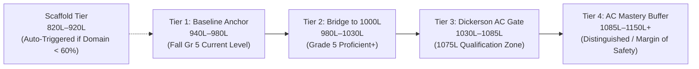

# Topic 3, 4 & 5: High-ROI Cognitive Learning Techniques & Diagnostic 5th-Grade BEACON Reading Curriculum

**Target Student Profile:** Lucas Ramirez (5th Grade, Cobb County School District — Nickajack ES $\rightarrow$ Dickerson MS Advanced Content Track)  
**Psychometric Goal:** Progress from **940L** (Fall Grade 5 Official BEACON) to **1075L–1150L+** by Winter (`12/2026`) and Spring (`03/2027`) Grade 5 BEACON to comfortably exceed Dickerson Middle School's strict **1075L** placement cutoff for 6th Grade Advanced Content (AC) ELA, Reading, Social Studies, and Science.

---

## 1. Lucas's Official DRC BEACON Baseline Trajectory (Topic 5 Context)

| Test Window | Grade Level | Official BEACON Lexile | Delta | Diagnostic Interpretation |
| :--- | :--- | :--- | :--- | :--- |
| **Spring (`03/19/2025`)** | Grade 3 | **835L** | Baseline | Strong 3rd-grade literal comprehension; narrative intuition carrying score. |
| **Fall (`09/04/2025`)** | Grade 4 | **840L** | `+5L` | Entering 4th grade with stable literal recall; beginning transition to multi-paragraph informational texts. |
| **Winter (`12/17/2025`)** | Grade 4 | **830L** | `-10L` | Mid-year stagnation as Grade 4 BEACON introduces denser Tier 2 vocabulary and implicit DOK 2–3 inferences. |
| **Spring (`03/18/2026`)** | Grade 4 | **800L** | `-30L` | Classic 4th-grade "syntactic & evidence wall": passive voice, multi-clause sentences, and 2-part EBSR items penalize reading by gist/intuition. |
| **Fall (`09/01/2026`)** | Grade 5 | **940L** | **`+140L`** | **Breakthrough after V1 Simulator Practice:** Explicit training on "Monster Sentences," Tier 2 context words, and "The Text is the Law" produced a +140L surge. |
| **Winter (`12/2026`) & Spring (`03/2027`) Target** | Grade 5 | **1075L–1150L+** | **`+135L to +210L`** | **V2 Objective:** Close the remaining 135L+ gap to lock in Dickerson MS 6th Grade AC qualification (`>= 1075L`). |

> [!IMPORTANT]
> **What the 800L $\rightarrow$ 940L Jump Proves:** Lucas does not have a foundational decoding or basic reading problem. His +140L jump demonstrates that when he slows down to decode complex syntax and verifies claims against line evidence, his functional reading ceiling jumps immediately. Moving from **940L $\rightarrow$ 1100L+** requires shifting from *general passage practice* to **diagnostic, domain-targeted deliberate practice** across the specific syntactic, semantic, and psychometric traps of 1000L–1150L DRC BEACON items.

---

## 2. Topic 3: High-ROI Cognitive Learning & Deliberate Practice Techniques

In standardized reading comprehension (DRC BEACON / Georgia Milestones), **ROI = Lexile & Skill Mastery Gain per Minute of Active Student Attention**. For a 10–11-year-old 5th grader, prefrontal working memory and sustained executive attention drop sharply after 12–15 minutes of high-cognitive-load reading. V2 replaces passive "test taking" with six high-leverage cognitive mechanisms:

### 2.1 Time-Boxed Micro-Dosing & Spaced Interleaving (The "10–12 Minute Rule")
* **Cognitive Mechanism:**
  * **Working Memory Protection:** Reading at `1000L–1150L` (100L+ above Lucas's 940L baseline) imposes heavy intrinsic cognitive load (Sweller, 2011). After ~12 minutes, 10–11-year-olds experience *vigilance decrement*, reverting to impulsive guessing (`< 12 seconds/item`) and gist-based reading.
  * **Spacing & Interleaving Effect (Cepeda et al., 2006; Rohrer, 2012):** Five 10-minute daily sessions spaced across the week produce **~2x greater long-term retention and transfer** than a single 50-minute weekend marathon. Interleaving question domains (Syntax, Tier 2 Vocab, Central Idea, Text Structure, EBSR Proof) forces the brain to continually reload discrimination rules rather than running on autopilot.
* **V2 Product Implementation:**
  * **Daily Precision Workout (`10–12 mins`):** Strictly capped at **1 high-interest passage (180–280 words)** + **5 interleaved diagnostic items** (or **2 rapid micro-drills + 1 mini-passage**).
  * **Pacing Guardrails:** Hard minimum deliberation lock (e.g., 8-second anti-impulse shield before "Lock In Response" activates on DOK 2/3 items) and gentle visual pacing telemetry (`Target: 35–75s per item`).

### 2.2 Active Text Verification ("Click-to-Prove" / Highlighting Before Answering)
* **Cognitive Mechanism:**
  * **Pre-Emptive Retrieval vs. Lure Contamination (Roediger & Butler, 2011):** In multiple-choice reading tests, reading the 4 options *before* locating textual proof contaminates working memory with plausible-sounding distractors. Once a 5th grader reads an attractive "Outside Knowledge" or "Verbatim Word-Match" distractor, confirmation bias makes the wrong answer feel familiar.
* **V2 Product Implementation:**
  * **2-Step "Click-to-Prove" Mode (Scaffolding for Developing Domains):** Before the A/B/C/D options unlock (or on Part B of EBSR items and Pillar 3 Evidence items), the prompt asks: *"Click the sentence in Paragraph [X] that holds the proof for this question."*
  * Clicking a sentence highlights it in glowing gold/emerald in the left-hand passage pane. Only after anchoring on the text does the student evaluate the options.

### 2.3 Syntactic Chunking ("Sentence Surgery")
* **Cognitive Mechanism:**
  * **Syntactic Working Memory Bottleneck (Perfetti & Stafura, 2014):** The primary differentiator between an `850L` passage and an `1100L` passage on DRC BEACON is **sentence length and clause embedding** (22–32 words per sentence, passive voice reversals, appositive bridges, and front-loaded subordinate clauses). 5th graders often assign the action verb to the nearest noun rather than the grammatical subject.
* **V2 Product Implementation:**
  * **Interactive "Sentence Surgery" Micro-Drill:** Instead of a static tooltip, V2 turns Monster Sentences into a 30-second interactive deconstruction step:
    1. **Strike the Noise:** Student clicks to dim/cross out prepositional phrases (`by...`, `of...`, `during...`) and appositive inserts between commas.
    2. **Tag the Core Kernel:** Student tags `[WHO / Real Actor]` $\rightarrow$ `[ACTION VERB]` $\rightarrow$ `[WHAT / Receiver]`.
    3. **Passive-to-Active Flip:** For passive sentences (*"The telemetry packets, compressed by onboard algorithms, were scrutinized by flight directors"*), the UI visually animates the flip to active order (*"Flight directors scrutinized the telemetry packets"*).

### 2.4 Contextual Morphology & Tier 2 Triangulation
* **Cognitive Mechanism:**
  * **Morphological Problem-Solving (Bowers, Kirby, & Deacon, 2010; Nagy et al., 2006):** By 5th grade, 60%+ of unfamiliar academic words encountered in 1000L–1150L passages are morphologically complex (Greek/Latin roots + derivational affixes) and embedded in explicit discourse relationships (contrast, cause/effect, apposition).
* **V2 Product Implementation:**
  * **The 4-Step "Word Detective" Triangulation Loop:**
    1. **Spot the Signal:** Identify the sentence connector (`however`, `unlike`, `consequently`, `in other words`, `despite`).
    2. **Crack the Root/Affix:** Highlight the morpheme (e.g., *`anom-`* = irregular/not normal; *`scrutin-`* = examine closely; *`mitig-`* = make milder; *`obstin-`* = stubbornly stand).
    3. **Predict a Simple Synonym:** Mentally plug in a 4th-grade word (*"Wait—is this word positive or negative? Does it mean help or block?"*).
    4. **Match & Verify:** Check that the chosen option preserves the exact sentence logic.

### 2.5 Metacognitive Distractor Trap Recognition ("Name the Trap")
* **Cognitive Mechanism:**
  * **Error-Pattern Inoculation (Metcalfe, 2017):** Standardized test writers use a finite set of psychometric distractor blueprints. Teaching a 10-year-old to treat wrong answers as *deliberate traps designed by test makers* shifts their mindset from passive reader to "test detective" and reduces repeat errors by over 50%.
* **The 4 Core DRC BEACON Distractor Trap Archetypes:**

| Trap Code | Student-Friendly Name | How the BEACON Test Writer Builds It | Antidote Rule for Lucas |
| :--- | :--- | :--- | :--- |
| **`TRAP_WORD_MATCH`** | **The Copy-Paste Illusion** (*Verbatim Word-Match*) | Uses exact, memorable words from the passage, but scrambles *who did what* (passive voice confusion) or flips cause and effect. | *"Same words $\neq$ right answer. Check the subject and verb!"* |
| **`TRAP_TOO_NARROW`** | **The Tiny Detail Trap** (*Too Narrow / Minor Detail*) | States a 100% true fact from a single sentence, but offers it as the *Main Idea*, *Summary*, or *Central Theme* of the whole passage. | *"True in one line doesn't make it the boss of the whole passage."* |
| **`TRAP_EXTREME`** | **The Danger Word Trap** (*Extreme / Absolute Language*) | Uses absolute qualifiers (**always, never, completely, only, everyone, proves beyond doubt**) when the passage uses careful academic tone (*often, suggests, can lead to*). | *"Circle extreme words (`always`, `never`, `only`)—unless the text says 100%, cross it out!"* |
| **`TRAP_OUTSIDE_INFO`** | **The Smart Kid Trap** (*Unsupported Outside Knowledge / Intuition*) | States something scientifically true in the real world (about space, dinosaurs, physics) or emotionally plausible in a story, with **zero line proof** in the passage. | *"If your finger can't touch the proof on the screen, it's illegal!"* |

* **V2 Product Implementation:**
  * **"Eliminate & Tag" Mode:** Students can right-click (or tap `[🚫 Strike]`) on options to cross them out before submitting, earning bonus `+5 Detective XP` when they correctly identify the main trap after answering.

### 2.6 Immediate Elaborative Feedback Loop
* **Cognitive Mechanism:**
  * **Explanatory vs. Verification Feedback (Hattie & Timperley, 2007; Shute, 2008):** Showing a student "Incorrect — the answer is B" at the end of a 15-question test has near-zero effect size (`d < 0.15`) because the student has already forgotten their cognitive state during Question 3. Immediate, item-level **elaborative feedback** delivered within 1 second of locking in a response yields effect sizes of `d = 0.70–0.85` (2–3x faster skill transfer).
* **V2 Product Implementation:**
  * Every item submission immediately triggers a structured **3-Part Elaborative Feedback Card** while simultaneously highlighting the exact proof sentence in the left passage pane:
    1. **✅ The Verbatim Proof Anchor:** Highlights the exact sentence in `[Paragraph X]` and shows the 1-line logical bridge (*"Paragraph 2 states: '...' which directly proves Option B"*).
    2. **🪤 Why Your Choice Was a Trap (if incorrect):** Explicitly names the trap triggered (e.g., *"You picked Option A — **The Copy-Paste Illusion (`TRAP_WORD_MATCH`)**. Even though 'soil tests and battery records' appear right before the verb, they are inside a descriptive phrase. The flight controllers did the scrutinizing."*).
    3. **🧠 10-Second Takeaway Rule:** A single memorable rule for the next question.

---

## 3. Topic 4 & 5: Diagnostic 5th-Grade BEACON Curriculum & Evaluation Matrix

### 3.1 Lexile Progression Ladder (Seeded from Lucas's 940L Baseline)
Instead of serving random passage difficulties, V2 organizes passages and items into a **5-Tier Lexile Staircase** anchored on Lucas's official **940L** Fall Grade 5 BEACON score, with an automatic **800L–920L Foundation Scaffold** whenever a specific skill domain drops below `60%` accuracy:

| Curriculum Tier | Lexile Band | Avg Sentence Length & Syntactic Profile | Target Accuracy to Advance | Strategic Purpose for Lucas |
| :--- | :--- | :--- | :--- | :--- |
| **Tier 0: Targeted Scaffold** | **820L – 920L** | 14–18 words/sentence; single-clause passive or clear signal words. | `>= 80%` (2 consecutive drills) | Isolates and repairs a weak skill (e.g., EBSR Part B or Theme vs. Detail) without syntactic overload. |
| **Tier 1: Baseline Anchor** | **940L – 980L** | 18–21 words/sentence; 1 embedded clause per paragraph; core Tier 2 verbs. | `>= 80%` across 15+ items | Consolidates Lucas's Sept 2026 **940L** gains and eliminates impulsive errors. |
| **Tier 2: Bridge Tier** | **980L – 1030L** | 20–24 words/sentence; passive reversals + contrast/concession transitions (`nevertheless`, `whereas`). | `>= 80%` across 20+ items | Builds stamina for mid-5th-grade CAT upward routing. |
| **Tier 3: Dickerson AC Gate** | **1030L – 1085L** | 23–28 words/sentence; nested appositives, abstract Tier 2 nouns, DOK 3 paired synthesis. | `>= 80%` across 25+ items | **Crosses the 1075L Dickerson Middle School AC cutoff.** |
| **Tier 4: Mastery Buffer** | **1085L – 1150L+** | 26–32 words/sentence; dense scientific/historical prose, distal pronoun tracking, subtle tone shifts. | `>= 75%` sustained | Guarantees that even a "-30L bad test day" still lands safely above `1075L`. |

---

### 3.2 The 5 Core DRC BEACON Reading Skill Domains (Mapped to Georgia 5th Grade ELA Standards)

V1 tracked 3 broad pillars (Syntax, Vocab, Evidence). To align 1:1 with the **DRC BEACON / Georgia Milestones Grade 5 Reading & Vocabulary Blueprint** while preserving V1's proven syntactic & EBSR strengths, V2 evaluates and tracks **5 Granular Skill Domains** (and 14 sub-skills):

| Domain ID & Name | Georgia 5th Grade ELA Standards (GSE) | Sub-Skills Tracked in V2 | Typical DOK | Why 5th Graders at 940L Miss These Items |
| :--- | :--- | :--- | :--- | :--- |
| **Domain 1: Key Ideas & Details** *(Literary & Informational)* | `ELAGSE5RL1–3` `ELAGSE5RI1–3` | • **1A: Central Idea & Theme** (`RI2` / `RL2`): Determining overall main idea or literary theme vs. supporting topic. • **1B: Objective Summary** (`RI2` / `RL2`): Selecting multi-sentence summaries free of minor details (`TRAP_TOO_NARROW`) or personal opinions. • **1C: Implicit Inference & Relationships** (`RI1,3` / `RL1,3`): Explaining how two characters, historical events, or scientific concepts interact. | DOK 2–3 | Students pick a vivid, true detail from Paragraph 1 or 3 (`TRAP_TOO_NARROW`) instead of synthesizing the overarching claim across all paragraphs. |
| **Domain 2: Craft & Structure** *(Vocab, Structure & POV)* | `ELAGSE5RL4–6` `ELAGSE5RI4–6` `ELAGSE5L4–5` | • **2A: Contextual Tier 2 Vocabulary & Morphology** (`RI4` / `L4`): Using context signals + Greek/Latin roots to decode polysemous/academic words. • **2B: Figurative Language & Connotation** (`RL4` / `L5`): Metaphors, similes, idioms, and positive/negative/neutral word tone. • **2C: Overall Text Structure** (`RI5` / `RL5`): Identifying *Chronology, Comparison, Cause/Effect, or Problem/Solution* across paragraphs. • **2D: Point of View & Author's Purpose** (`RL6` / `RI6`): How narrator perspective or author purpose shapes how events are described. | DOK 2–3 | Students rely on a familiar 3rd-grade meaning of a word instead of its contextual meaning in the passage, or confuse *Cause/Effect* with *Problem/Solution*. |
| **Domain 3: Integration of Knowledge & Ideas** *(Claims & Multi-Text)* | `ELAGSE5RL7,9` `ELAGSE5RI7–9` | • **3A: Author's Claims & Supporting Reasons** (`RI8`): Identifying which specific evidence/reason supports a particular point made by the author. • **3B: Cross-Paragraph & Paired-Text Synthesis** (`RI7,9` / `RL9`): Integrating information from two paragraphs or paired micro-passages on the same topic/theme to draw a unified conclusion. | DOK 3 | High working-memory load: requires holding Claim A from Paragraph 1 in mind while evaluating Evidence B in Paragraph 3 (or Passage 2). |
| **Domain 4: Syntactic Decoding ("Monster Sentences")** | `ELAGSE5L1,3` *(Applied to 950L–1150L Reading)* | • **4A: Passive Voice & Inverted Actor Tracking**: Identifying who performed the action when the receiver comes first (*"was scrutinized by..."*). • **4B: Nested Clauses & Appositive Stripping**: Isolating the main Subject-Verb across multi-comma inserts. • **4C: Distal Pronoun & Referent Tracking**: Tracing words like *this phenomenon, their reluctance, such constraints* back to the antecedent in the prior sentence. | DOK 2 | Directly governs the **Syntactic Complexity** variable of the Lexile formula; causes `TRAP_WORD_MATCH` errors when misread. |
| **Domain 5: EBSR Paired-Evidence Mastery** | `ELAGSE5RL1` `ELAGSE5RI1` *(Psychometric 2-Part Format)* | • **5A: Claim-to-Quote Verification (Part A + Part B Joint Mastery)**: Selecting the exact verbatim quote in Part B that proves the inference in Part A. • **5B: Eliminating "Intuition Without Proof"**: Catching when Part B quotes a nearby sentence that shares topic words but does *not* logically prove the Part A claim. | DOK 2–3 | DRC BEACON heavily weights 2-part EBSR items. Getting Part A right by intuition but missing Part B costs 50%–100% of the item's upward CAT routing credit. |

---

## 4. V2 Diagnostic Engine & Adaptive Prescription Algorithm

To ensure both **Lucas** (in the Student Mission Control) and **Parents** (in the Diagnostic Dashboard) always see the exact bottleneck holding back his Lexile growth—and can launch a targeted fix in one click—V2 implements a closed-loop **Diagnostic & Prescription Engine**.

### 4.1 Initial Seed State (Bootstrapping from Lucas's 940L Baseline + V1 History)
When V2 initializes for Lucas:
1. **Baseline Lexile Anchor ($L_{\text{current}}$):** Seeded at **`940L`** (reflecting his official `09/01/2026` Fall Grade 5 BEACON score), with historical checkpoints (`835L`, `840L`, `830L`, `800L`, `940L`) pre-loaded into the **Official BEACON Trajectory Chart**.
2. **Calibration / Cold-Start Handling:**
   * Existing V1 item submissions (`p1`, `p2`, `p3`, `ebsrMetrics`, `distractorsCount`) are automatically mapped into the 5 V2 Domains (`Pillar 1` $\rightarrow$ `Domain 4`, `Pillar 2` $\rightarrow$ `Domain 2A/2B`, `Pillar 3` $\rightarrow$ `Domain 1/3`, `ebsrMetrics` $\rightarrow$ `Domain 5`).
   * For any sub-skill with fewer than `5` attempted items (`Confidence = Low`), the engine schedules a **12-Item Baseline Diagnostic Sweep** (split across two 10-minute sessions at `940L–1020L`) so every sub-skill quickly reaches `Confidence = Calibrated (n >= 5)`.

### 4.2 Ongoing Domain Mastery Scoring Formula
For each of the 5 Domains ($d \in \{1..5\}$) and sub-skills, V2 computes a real-time **Domain Mastery Score ($M_d \in [0, 100]$)** using an exponentially recency-weighted, DOK- and Lexile-adjusted formula:

$$M_d = \frac{\sum_{i=1}^{N_d} w_{\text{recency}}(i) \cdot w_{\text{DOK}}(i) \cdot w_{\text{Lexile}}(i) \cdot S_i}{\sum_{i=1}^{N_d} w_{\text{recency}}(i) \cdot w_{\text{DOK}}(i) \cdot w_{\text{Lexile}}(i)} \times 100$$

Where:
* **Recency Weight ($w_{\text{recency}}$):** Last 10 items in the domain carry weight `1.0`; older items decay by $0.85^k$ so recent breakthroughs immediately move the dashboard needle instead of being dragged down by months-old attempts.
* **DOK Weight ($w_{\text{DOK}}$):** `DOK 1 = 0.8`, `DOK 2 = 1.0`, `DOK 3 = 1.3` (rewarding higher-order strategic thinking required on adaptive upper-branch items).
* **Lexile Difficulty Weight ($w_{\text{Lexile}}$):** Items at `< 940L = 0.85`, `940L–1020L = 1.0`, `1030L–1085L = 1.2`, `1090L+ = 1.35`.
* **Item Score ($S_i$):**
  * Standard single-select item: `1.0` if correct (`0.0` if incorrect).
  * Paired EBSR (Part A + Part B): `1.0` if **Both Correct**; `0.35` if **Part A Only Correct** (flags *"Intuition Without Proof"*); `0.0` otherwise.

#### Mastery Status Thresholds (Displayed on Student & Parent Cards)
* 🟢 **Mastered (`M_d >= 82%` at `>= 1050L`):** Ready for Dickerson AC (`1075L+`); placed on spaced maintenance (1 review item every 4 sessions).
* 🔵 **On Track / Developing (`68% <= M_d < 82%`):** Progressing at current Lexile tier; eligible for upward Lexile step when last 5 items hit 80%.
* 🟡 **Priority Focus (`55% <= M_d < 68%`):** Active bottleneck; prioritized in daily workout selection.
* 🔴 **Critical Gap (`M_d < 55%` or `>= 3` recent triggers of the same Distractor Trap):** Automatically triggers a **Scaffolded Micro-Drill (`840L–940L`)** with mandatory **"Click-to-Prove"** or **"Sentence Surgery"** enabled before re-testing at `980L–1050L`.

---

### 4.3 Dynamic "Highest-ROI Daily Workout" Selection Algorithm
Every time Lucas opens the app, the **"Today's Recommended 10-Minute Precision Workout"** banner is dynamically generated by ranking all 5 Domains and 4 Trap Archetypes by **Priority Deficit Score ($P_d$)**:

$$P_d = (85 - M_d) \times \text{BlueprintWeight}_d + (15 \times \text{RecentTrapSpike}_d) + (10 \times \text{DaysSinceLastPracticed}_d)$$

#### How the Daily 10-Minute Session is Assembled:
1. **Step 1 — 2-Minute Cognitive Warm-Up (Micro-Drill):**
   * Targets Lucas's **#1 highest-$P_d$ bottleneck** in isolation (e.g., if `Domain 4: Passive Voice` or `Domain 2A: Tier 2 Morphology` is flagged, serve 2 rapid interactive "Sentence Surgery" or "Word Detective" cards).
2. **Step 2 — 8-Minute Adaptive Passage Mission (1 Passage + 5 Targeted Items):**
   * Selects an unseen passage at Lucas's **Optimal Challenge Lexile** ($L_{\text{target}} = L_{\text{current}} + 40\text{L}$, i.e., starting at **`980L–1000L`** from his `940L` baseline and stepping up by `+35L` whenever rolling 2-mission accuracy $\ge 80\%$).
   * **Interleaved 5-Item Composition:**
     * **2 Items** directly targeting his **#1 Priority Domain** (with active scaffolding if $M_d < 65\%$).
     * **1 Paired EBSR Item (Part A + Part B)** enforcing verbatim line verification (`Domain 5`).
     * **2 Spaced-Retrieval Items** sampling other domains (`Domains 1–4`) to prevent skill decay and maintain interleaving.
3. **Step 3 — 1-Minute Metacognitive Wrap-Up & Parent Sync:**
   * Displays immediate Elaborative Feedback after each question, awards bonus XP for zero impulsive clicks (`>= 15s` deliberation) and accurate trap tagging, and updates the **Parent Diagnostic Dashboard** with a plain-English prescription (e.g., *"Lucas mastered 980L Tier 2 Vocabulary today (4/4), but triggered 'The Tiny Detail Trap' twice on Central Idea items. Tomorrow's workout will focus on Domain 1A: Central Idea vs. Minor Detail."*).
