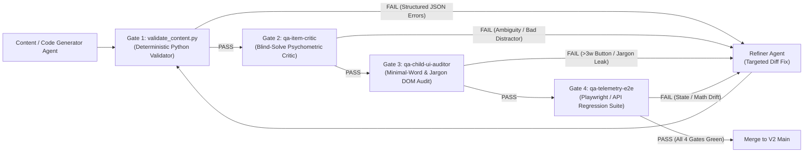
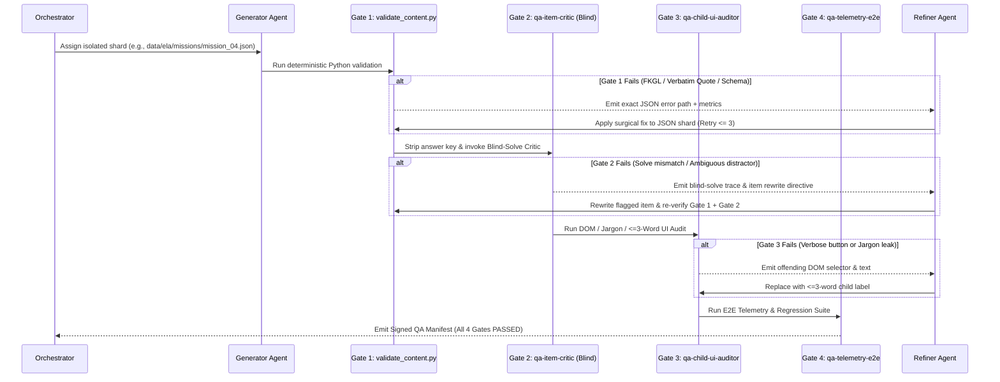

# Topic 8: V1-to-V2 Architectural Lessons Learned, Multi-Agent QA Strategy & Iterative Feedback Loops

**Repository Audited (V1):** `/usr/local/google/home/ivanramirez/.gemini/jetski/scratch/drc-beacon-ela-app`  
**Target Architecture (V2):** Modularized, Schema-Validated Adaptive DRC BEACON ELA & Math Platform

---

## 1. Technical & Content Audit of V1 (`index.html`, `main.py`, `git log`)

### 1.1 What Worked Well in V1 (Preserve & Elevate in V2)

| Capability | V1 Implementation Evidence | Real-World & Architectural Value |
| :--- | :--- | :--- |
| **1. Real-World Pedagogical Efficacy (+140L Gain)** | Three-pillar ELA framework (**Pillar 1:** Syntactic "Monster Sentence" passive-voice decoding; **Pillar 2:** Tier 2 contextual vocabulary; **Pillar 3:** *"The Text is the Law"* explicit proof) paired with calibrated 940L–1150L passages. | **Lucas achieved a verified +140L real-world gain (800L → 940L)**, validating that explicit syntactic deconstruction + paired evidence eliminates bright-student "intuition guessing." |
| **2. Cloud-Native Persistence with Dual Fallback** | `app/main.py` (243 lines, FastAPI + `google-cloud-firestore` on `lexile-growth-db`) + automatic local `/tmp/{student_id}_progress.json` fallback + browser `localStorage` (`drc_student_progress_${studentId}`, commits `f854488`, `6c7feff`). | Zero-cost ($0/mo GCP Free Tier) stateless Cloud Run deployment with zero data loss during offline use or multi-student switching (`lucas` vs. `evelyn_mietling`). |
| **3. Split-Screen DRC BEACON Simulation UI** | 12-column desktop split view (`lg:col-span-7` passage pane with `[Paragraph N]` badges and `.tier2-word` popups; `lg:col-span-5` question pane with bidirectional `← Prev` / `Next →` nav and status dots, commits `23495e4`, `ecd77f1`). | Mirrors the official Cobb County DRC BEACON testing interface, training visual scanning and paragraph-indexed evidence lookup. |
| **4. Multi-Stage Adaptive CAT/MST Engine** | 3-stage decision tree (`stage1` Router → `stage2_easy`/`medium`/`hard` → `stage3_remediation`/`solid`/`adv`/`elite`, commits `1aad8f7`, `fe20410`) with Rasch-style DOK 3 weighting (`calculatePsychometricScore`). | Branches dynamically after every 5-item stage, narrowing Standard Error of Measurement (SEM) to `±15L` / `±15Q` across a 15-item simulation. |
| **5. Paired EBSR (Part A / Part B) Mechanics** | Q4 (Part A claim) dynamically injects the student's chosen claim into a callout box on Q5 (Part B verbatim line quote) and tracks `pairedBothCorrect` vs. `partAOnlyCorrect` (*"Intuition Without Proof"*, commits `858dbcd`, `6110945`). |Directly targets the highest-weight item type on DRC BEACON and Georgia Milestones, isolating when a student guesses the right inference without textual proof. |
| **6. Dual Lexile + FKGL Readability Calibration** | `getFKGFromLexile()` helper (`5a2cd7f`) + full passage recalibration (`0a5fc37`, `53245ee`, `660b4ef`) spreading Missions 1–20 evenly from `940L` to `1150L` at **5.0–7.8 FKGL (6.6 mean)**. | Prevents LLM vocabulary bloat where a "950L" passage accidentally reads at a 14th-grade collegiate level. |
| **7. Dickerson MS 6th-Grade AC Placement Tracker** | `renderDickersonPlacementTracker()` (`577d070`, `a2769db`, `2e94d6a`) evaluating Latest Test and Last 2-Test Average against official 2025–2026 Dickerson MS cutoffs (`Lexile >= 1075L` for AC ELA/Reading/SS/Sci; `Quantile >= 950Q` for Math 6/7A; `>= 850Q` for Adv Math 6) + attempt deletion. | Gives parents an executive, actionable readiness dashboard tied directly to Cobb County's strict "Two-of-the-Following / No Waivers" placement matrix. |

---

### 1.2 V1 Pain Points & Failure Modes to Fix in V2

#### Pain Point 1: Monolithic 41,478-Line `app/static/index.html` (1.89 MB)
* **Audit Evidence:** V1 embeds all HTML views, CSS, 20 ELA missions, 20 Math missions, 3 targeted workouts, 10 Full-Length assessments, 10 CAT multi-stage trees, and 2,600+ lines of application logic inside a single 41,478-line file.
* **Observed Failure Modes in `git log`:**
  * **Regex / Quote Corruption (`c96012e`):** A script updating Q5 prompts across `index.html` produced unescaped nested quotes (`"Which quotation... \"It describes...\"?"It describes...\"?"`), breaking JS parsing for the entire app.
  * **Bracket Collision (`08dd957`):** Subagent array injection left a trailing `];; }` after `MISSIONS_DATA`, crashing the frontend on load.
  * **Accidental Content Truncation (`0a5fc37` → `53245ee`):** A bulk readability edit (`-7,653 / +4,951` lines) accidentally wiped out 17 of the 20 ELA missions (`@@ -1032,3219 +1032,511 @@`), requiring an emergency restoration commit (`53245ee`, `+2,856` lines) 16 minutes later.
  * **Global Scope & State Offset Bugs (`089ffab`, `b4d734e`):** `isMath` was referenced before initialization (`089ffab`), and `STATE.moduleAnswers[3]` was hardcoded without `stageOffset` (`b4d734e`), causing Stage 1 answers and feedback cards to leak into Stages 2 and 3 of CAT exams.
* **V2 Architectural Fix:**
  * **Zero Inline Content in HTML/JS:** Store every mission and CAT simulation as an isolated, schema-validated JSON file under `app/data/{ela,math}/{missions,cat}/` (1 file per assessment = zero merge collisions across parallel agents).
  * **Modular Frontend Architecture:** Split UI and logic into clean ES modules (`static/js/state.js`, `quiz-engine.js`, `cat-router.js`, `curriculum-engine.js`, `student-ui.js`, `parent-dashboard.js`).

#### Pain Point 2: LLM Content Drift (Readability Inflation, Boilerplate Text, Non-Verbatim Part B Quotes)
* **Audit Evidence:** Initial subagent content runs (`49546a9`, `6fbdcd1`, `fe20410`) produced:
  1. **Collegiate FKGL Drift:** Early `mission-1` was tagged `1020L` but written at **FKGL 14.8** (*"signal propagation is frequently degraded by atmospheric dust storms that absorb electromagnetic radiation"*).
  2. **Placeholder/Template Passages:** Initial CAT conversions (`fe20410`) emitted generic meta-text (*"In recent scientific investigations focusing on Deep Ocean Hydrothermal Vents... researchers discovered foundational patterns..."*) before `ecd77f1` replaced them.
  3. **Paraphrased Part B Options & Ridiculous Distractors:** Early Part B options paraphrased the passage instead of quoting verbatim, while some distractors were throwaway jokes (e.g., `m1-q2` Option B: *"Created by dangerous space aliens on Mars"*), requiring massive retroactive commits (`ecd77f1`, `0a5fc37`, `53245ee`, `660b4ef`) touching >20,000 lines.
* **V2 Architectural Fix:** Mandatory **Gate 1 (`validate_content.py`)** + **Gate 2 (`qa-item-critic`)** pre-commit pipeline that deterministically blocks any passage with out-of-bounds FKGL/Lexile, non-verbatim Part B quotes, or weak/implausible distractors before merge.

#### Pain Point 3: UI Verbosity & Psychometric Jargon in the Student View
* **Audit Evidence:** In V1 `index.html`, Student Mode (`#student-view-container`) exposes adult psychometric terminology directly to a 10-year-old child:
  * Question header badges display `"🎯 Pillar 3: Evidence-Based Extraction"`, `"🧩 Part A (DOK 3 Inference): Strategic Claim"`, and `"🔬 DOK 2: Syntax Deconstruction"` (`lines 303, 39738–39756`).
  * Post-answer feedback (`#feedback-card`, `lines 40018–40031`) displays `"⚠️ Distractor Trap Triggered!"` and `"Diagnostic Misconception: Selected option triggered 'Passive Voice Subject Confusion'"` alongside 60-word grammatical treatises.
  * CAT stage routing modals (`#cat-routing-modal`, `lines 363–397`) display `"Analyzing student Depth of Knowledge... Standard Error (SEM): Narrowing to ±15L"`.
  * The student home screen dumps 20 Mission cards + 10 CAT Test cards + 3 Focus Workouts on a single scrolling page with verbose buttons (`"🧬 Start Adaptive CAT Test →"`, `"Continue to Next Challenge →"`).
* **V2 Architectural Fix:** Enforce **Strict View Separation** and **Gate 3 (`qa-child-ui-auditor`)**:
  * **Student Mode:** Buttons/badges strictly `<= 3 words` (e.g., `"Start"`, `"Next →"`, `"← Back"`, `"Check"`). Zero psychometric jargon (`Pillar`, `DOK`, `EBSR`, `SEM`, `Distractor`, `Passive Voice Subject Confusion`). Post-answer child feedback capped at `<= 30 words` in warm, plain 5th-grade language.
  * **Parent Mode:** Houses 100% of the psychometric taxonomy, DOK matrices, distractor trap counters, Dickerson AC tracker, and detailed `parentDiagnosticExplanation` text.

#### Pain Point 4: Lack of an Automated Adaptive Daily Curriculum Engine
* **Audit Evidence:** V1 has no automatic daily queue; the child must browse 30+ cards to pick a module, and `LUCAS_TARGETED_WORKOUTS` (`96da5da`) is a static 3-item hardcoded list.
* **V2 Architectural Fix:** Implement a deterministic **Daily Curriculum Engine (`curriculum_engine.py` / `curriculum-engine.js`)** that scores each uncompleted (or spaced-repetition eligible) mission against the student's live telemetry (`weak_standards_weight * 0.45 + active_distractor_trap_weight * 0.35 + lexile_zpd_match * 0.20`) and surfaces a single hero CTA in Student Mode: **"Today's 10-Min Challenge"** (`Start →`).

---

## 2. Topic 8 — Multi-Agent QA Strategy & Automated Verification Pipeline

Every piece of V2 content, UI, and code must pass through a **4-Gate Automated Verification Pipeline** before merging.



---

### Gate 1: Deterministic Python Content & Readability Validator (`scripts/validate_content.py`)

A zero-LLM, deterministic Python CLI validator run on every JSON assessment file in `< 200ms`. Any violation returns exit code `1` with a machine-readable JSON array of exact field paths and fix instructions.

#### Gate 1 Hard Rules & Thresholds

| Check Category | Exact Deterministic Rule | Target Threshold / Enum |
| :--- | :--- | :--- |
| **1. Passage Word Count** | Strip HTML tags (`<span...>`) and `[Paragraph N]` markers; count whitespace-delimited tokens. | **Standard / CAT Passages:** `300 <= words <= 550` words.<br>**Micro-Drills:** `180 <= words <= 280` words. |
| **2. Paragraph Structure** | Split on `\n\n`; verify sequential headers `[Paragraph 1]` .. `[Paragraph N]`. | `4 <= paragraphs <= 6` (Standard/CAT); zero orphaned lines or markdown `**`. |
| **3. Readability (FKGL)** | Compute Flesch-Kincaid Grade Level: $0.39 \times (\text{words}/\text{sentences}) + 11.8 \times (\text{syllables}/\text{words}) - 15.59$. | `5.0 <= FKGL <= 7.8` (strictly graded by target band: Router `5.2–6.4`, Advanced `6.5–7.4`, Elite `7.0–7.8`). |
| **4. Calibrated Lexile Match** | Compute calibrated Lexile estimate from FKGL + Academic Word List (Tier 2) density; compare against `passage.targetLexile`. | `abs(computed_lexile - target_lexile) <= 25L`. |
| **5. Sentence Length Distribution** | Parse sentences via regex/punkt; check mean length, max length, and syntactic complexity anchor. | Mean: `12.0–20.0` words/sentence.<br>Max: `<= 38` words.<br>At least **1 "Monster Sentence"** (`22–36` words containing passive voice or subordinate clause) per ELA passage. |
| **6. EBSR Part B 100% Verbatim Quote Match** | For every question where `isEbsrPartB == True`, strip surrounding quotation marks from each option's `text` and check exact substring membership inside the HTML-stripped `passage.text`. | **100% of Part B options (A, B, C, D)** (or each quote in a two-quote option) MUST exist **100% verbatim** in the passage (`quote in clean_passage == True`). |
| **7. Schema & Distractor Archetypes** | Validate Pydantic schema for every item and option. | Required fields: `id`, `standardId` (valid GSE code, e.g., `ELAGSE5RI1`, `5.NF.A.1`), `skillCategory`, `dokLevel` (`1..3`), `options` (len 4, letters `A..D`), `correctIndex` (`0..3`).<br>Correct option `errorType == "correct"`.<br>All 3 wrong options MUST have a valid archetype from `ELA_ARCHETYPES` (`passive_subject_confusion`, `outside_knowledge`, `vocabulary_misinterpretation`, `unsupported_inference`, `detail_vs_central_idea`) or `MATH_ARCHETYPES` (`computational_error`, `misreading_operation`, `place_value_shift`, `denominator_addition_misconception`, `partial_step_completion`). |
| **8. Dual Feedback Split** | Validate separate child vs. parent explanation fields on every question. | `childFeedback`: required, `5 <= words <= 30`, zero banned psychometric terms.<br>`parentDiagnosticExplanation`: required, `>= 20 words`, explains both why the correct answer is right and why each distractor archetype traps students. |

#### Reference Implementation Blueprint (`scripts/validate_content.py`)

```python
#!/usr/bin/env python3
"""Gate 1: Deterministic Content, Readability, & Verbatim Quote Validator."""
import json, re, sys
from pathlib import Path

BANNED_CHILD_JARGON = {
    "pillar", "dok", "depth of knowledge", "ebsr", "distractor", "misconception",
    "syntactic", "semantic", "psychometric", "sem", "standard error", "quantile",
    "passive voice subject confusion", "unsupported narrative intuition", "outside knowledge reliance"
}
ELA_ARCHETYPES = {
    "passive_subject_confusion", "outside_knowledge", "vocabulary_misinterpretation",
    "unsupported_inference", "detail_vs_central_idea"
}
MATH_ARCHETYPES = {
    "computational_error", "misreading_operation", "place_value_shift",
    "denominator_addition_misconception", "partial_step_completion"
}

def strip_html(text: str) -> str:
    clean = re.sub(r"<[^>]+>", "", text)
    clean = re.sub(r"\[Paragraph\s+\d+\]\s*", "", clean)
    return re.sub(r"\s+", " ", clean).strip()

def count_syllables(word: str) -> int:
    w = re.sub(r"[^a-z]", "", word.lower())
    if not w: return 1
    if len(w) <= 3: return 1
    w = re.sub(r"(?:[^laeiouy]es|ed|[^laeiouy]e)$", "", w)
    w = re.sub(r"^y", "", w)
    vowels = re.findall(r"[aeiouy]{1,2}", w)
    return max(1, len(vowels))

def compute_readability(clean_text: str):
    sentences = [s.strip() for s in re.split(r"[.!?]+", clean_text) if s.strip()]
    words = re.findall(r"[A-Za-z']+", clean_text)
    if not sentences or not words:
        return {"words": 0, "fkgl": 0.0, "est_lexile": 0, "max_sent": 0, "mean_sent": 0.0}
    syllables = sum(count_syllables(w) for w in words)
    asl = len(words) / len(sentences)
    asw = syllables / len(words)
    fkgl = round(0.39 * asl + 11.8 * asw - 15.59, 2)
    # Inverse of V1 calibrated formula: fkg = (lexile - 250) / 115 + 0.5
    est_lexile = round((fkgl - 0.5) * 115 + 250)
    sent_lengths = [len(re.findall(r"[A-Za-z']+", s)) for s in sentences]
    return {
        "words": len(words),
        "fkgl": fkgl,
        "est_lexile": est_lexile,
        "mean_sent": round(asl, 1),
        "max_sent": max(sent_lengths),
        "monster_sentences": sum(1 for l in sent_lengths if l >= 22)
    }

def validate_passage_unit(unit_id: str, passage_raw: str, target_lexile: int, questions: list, is_math: bool = False) -> list:
    errors = []
    if not is_math:
        paragraphs = [p.strip() for p in re.split(r"\n\s*\n", passage_raw.strip()) if p.strip()]
        if not (4 <= len(paragraphs) <= 6):
            errors.append(f"[{unit_id}] Passage has {len(paragraphs)} paragraphs; expected 4..6.")
        for idx, p in enumerate(paragraphs, 1):
            if not p.startswith(f"[Paragraph {idx}]"):
                errors.append(f"[{unit_id}] Paragraph {idx} missing exact '[Paragraph {idx}]' prefix.")

        clean_passage = strip_html(passage_raw)
        metrics = compute_readability(clean_passage)
        if not (300 <= metrics["words"] <= 550):
            errors.append(f"[{unit_id}] Word count {metrics['words']} outside [300, 550].")
        if not (5.0 <= metrics["fkgl"] <= 7.8):
            errors.append(f"[{unit_id}] FKGL {metrics['fkgl']} outside [5.0, 7.8].")
        if abs(metrics["est_lexile"] - target_lexile) > 25:
            errors.append(f"[{unit_id}] Calibrated Lexile {metrics['est_lexile']}L drifts >25L from target {target_lexile}L.")
        if metrics["monster_sentences"] < 1:
            errors.append(f"[{unit_id}] Passage lacks a syntactic 'Monster Sentence' (>=22 words).")
        if metrics["max_sent"] > 40:
            errors.append(f"[{unit_id}] Runaway sentence detected ({metrics['max_sent']} words > 40 max).")

    valid_archetypes = MATH_ARCHETYPES if is_math else ELA_ARCHETYPES
    for q_idx, q in enumerate(questions):
        qid = q.get("id", f"{unit_id}-q{q_idx+1}")
        for req in ("standardId", "skillCategory", "dokLevel", "correctIndex", "childFeedback", "parentDiagnosticExplanation"):
            if req not in q or q[req] in (None, ""):
                errors.append(f"[{qid}] Missing required field '{req}'.")

        cf = q.get("childFeedback", "")
        cf_words = len(cf.split())
        if not (5 <= cf_words <= 30):
            errors.append(f"[{qid}] childFeedback has {cf_words} words; must be 5..30 words.")
        for banned in BANNED_CHILD_JARGON:
            if banned in cf.lower():
                errors.append(f"[{qid}] childFeedback contains banned psychometric jargon: '{banned}'.")

        opts = q.get("options", [])
        if len(opts) != 4:
            errors.append(f"[{qid}] Expected 4 options, found {len(opts)}.")
            continue

        c_idx = q.get("correctIndex")
        for o_idx, opt in enumerate(opts):
            et = opt.get("errorType")
            if o_idx == c_idx and et != "correct":
                errors.append(f"[{qid}] Option {opt.get('letter')} is correctIndex={c_idx} but errorType='{et}'.")
            elif o_idx != c_idx and et not in valid_archetypes:
                errors.append(f"[{qid}] Distractor {opt.get('letter')} has invalid errorType='{et}'.")

            # EBSR Part B 100% Verbatim Quote Check
            if not is_math and (q.get("isEbsrPartB") or q_idx == 4):
                quote_clean = opt.get("text", "").strip().strip('"').strip("'")
                if quote_clean not in clean_passage:
                    errors.append(f"[{qid}] Part B Option {opt.get('letter')} is NOT 100% verbatim in passage: \"{quote_clean[:60]}...\"")
    return errors
```

---

### Gate 2: Adversarial Psychometric & Pedagogy Critic Agent (`qa-item-critic`)

Deterministic rules catch structural errors, but cannot catch **ambiguous stems, defensible distractors, or weak inferences**. `qa-item-critic` is an isolated LLM subagent that audits items using a **Blind-Solve Protocol**.

#### Protocol Specification
1. **Input Stripping (Zero Answer-Key Leakage):** Before invoking `qa-item-critic`, a preprocessor strips `correctIndex`, `errorType`, `childFeedback`, and `parentDiagnosticExplanation` from the JSON payload. The critic sees **only** the passage, question stems, standard IDs, DOK tags, and options A–D.
2. **Blind-Solve & Psychometric Audit Tasks:**
   * **Task A — Independent Blind Solve:** For each item, the critic selects the best answer (`A..D`), cites the exact proving line(s) from the passage, and assigns a `solve_confidence` (`0.0–1.0`).
   * **Task B — Distractor Plausibility & Defensibility Audit:** For each of the 3 options the critic did *not* pick, the critic rates:
     * `ambiguity_risk` (`LOW | MEDIUM | HIGH`): Could a bright 5th grader reasonably argue this option is *also* correct based on the text?
     * `implausibility_flag` (`True | False`): Is this option a throwaway/absurd joke (e.g., *"dangerous space aliens on Mars"*) rather than a diagnostic 5th-grade misconception?
   * **Task C — EBSR Entailment Verification:** Verifies that the chosen Part B verbatim quote directly proves the chosen Part A claim, and that the other 3 Part B quotes are genuine passage sentences that fail to prove the claim.
   * **Task D — Cobb County DRC BEACON Style Check:** Verifies the stem matches authentic Georgia Milestones / DRC BEACON phrasing for the tagged GSE standard and DOK level.
3. **Pass/Fail Gate Criteria:**
   * **PASS:** `critic_choice == author_correctIndex` AND `solve_confidence >= 0.90` AND zero `HIGH` `ambiguity_risk` distractors AND zero `implausibility_flag == True` options.
   * **FAIL:** Any mismatch or flag returns a structured critique (`item_id`, `failure_reason`, `recommended_rewrite`) directly to the **Refiner Agent**.

---

### Gate 3: Minimal-Word Child UI & UX Auditor Agent (`qa-child-ui-auditor`)

Prevents V1's UI verbosity and adult psychometric leakage from ever appearing in Student Mode (`#student-view-container`).

#### Automated DOM & Template Audit Rules
1. **The `<= 3 Words` Interactive Control Rule:**
   * Scans all `<button>`, `<a role="button">`, `.badge`, and `.pill` elements inside `#student-view-container`.
   * Strips leading/trailing emojis and numeric counters (e.g., `1/5`, `940L`), then counts words.
   * **Hard Limit:** `word_count <= 3` words.
   * *V1 Violations Blocked → V2 Replacements:*
     * `"Lock in Response →"` (4 words) → `"Check Answer"` (2 words)
     * `"Continue to Next Challenge →"` (4 words) → `"Next →"` (1 word)
     * `"🧬 Start Adaptive CAT Test →"` (5 words) → `"Start Test"` (2 words)
     * `"← Back to Missions"` (3 words) → `"← Home"` (1 word)
     * `"🔬 Monster Sentence Inspector"` (3 words) → `"💡 Sentence Clue"` (2 words)
2. **Zero Psychometric Jargon in Student View:**
   * Scans all visible text nodes, modal templates, and dynamic string literals bound to `#student-view-container` against `BANNED_CHILD_JARGON`.
   * *V1 Violations Blocked → V2 Replacements:*
     * Question badge `"🎯 Pillar 3: Evidence-Based Extraction"` → `"🔍 Find Proof"` (2 words)
     * Question badge `"🧩 Part A (DOK 3 Inference): Strategic Claim"` → `"🧩 Part A"` (2 words)
     * Question badge `"🔍 Part B (DOK 3 Proof): Paired Line Evidence"` → `"🔍 Part B"` (2 words)
     * Feedback header `"⚠️ Distractor Trap Triggered!"` → `"💡 Try Looking Here"` (3 words)
     * CAT Modal `"Standard Error (SEM): Narrowing to ±15L"` → Hidden in Student Mode; replaced with a 2-word stage banner: `"🌟 Level Up!"`
3. **Student Home Cognitive Load Rule:**
   * Verifies that Student Mode defaults to a single primary **"Today's Challenge"** card (`<= 25 words` total card copy + 1 primary `"Start"` button), with optional Secondary Exploration tucked behind a clean `"All Missions"` tab.

---

### Gate 4: End-to-End Telemetry & Regression QA Agent (`qa-telemetry-e2e`)

A deterministic Playwright + FastAPI `TestClient` suite that simulates multi-day student practice sessions and verifies end-to-end state, math, and UI invariants.

#### Mandatory E2E Simulation Scenarios

| Scenario ID | Simulation Action | Verified Invariant (Must Equal 100%) |
| :--- | :--- | :--- |
| **E2E-1: Multi-Stage CAT Isolation (Regression `b4d734e`)** | Simulate a 15-item Adaptive CAT session (`Stage 1: 5/5` → `Stage 2 Hard: 4/5` → `Stage 3 Elite: 4/5`) with bidirectional `← Prev` / `Next →` clicks inside each stage. | 1. Entering Q1 of Stage 2 or Stage 3 shows an **unanswered** state (`feedback-card` hidden).<br>2. Q5 (Part B) in Stage 2/3 displays the **active stage's** Q4 (Part A) claim, never Stage 1's claim.<br>3. `answers.length == 15` with zero `null`/`undefined` entries. |
| **E2E-2: Telemetry & Distractor Counter Conservation** | Submit a scripted sequence of 10 items (7 correct, 3 wrong with known `errorType` tags: 1 `passive_subject_confusion`, 1 `outside_knowledge`, 1 `partAOnlyCorrect` EBSR split). | 1. `analytics.totalAttempted == +10`, `totalCorrect == +7`.<br>2. Exact `dokBreakdown` (`dok1`, `dok2`, `dok3`) and `standardMastery[standardId]` increments.<br>3. `ebsrMetrics.partAOnlyCorrect == +1`.<br>4. `distractorsCount.passive_subject_confusion == +1` and `outside_knowledge == +1`. |
| **E2E-3: Adaptive Daily Curriculum Queueing** | Inject a student profile with low mastery (`40%`) on `ELAGSE5RI2` / `5.NF.A.1` and high triggers on `passive_subject_confusion`. Call `getNextDailyAssessment(studentId)`. | The Daily Curriculum Engine deterministically queues an uncompleted 10-minute mission targeting `ELAGSE5RI2` / `5.NF.A.1` at the student's current ZPD Lexile/Quantile (`±30L`). |
| **E2E-4: Parent Analytics, Dickerson Matrix & Deletion Sync** | Complete 2 Full-Length CAT tests (`1060L` and `1100L`), verify Parent Dashboard, then invoke `deleteAssessmentAttempt()` on Test 2. | 1. After 2 tests: Latest = `1100L`, 2-Test Avg = `1080L`, Dickerson AC ELA/Reading/SS/Sci cards all show `🟢 QUALIFIED (Beacon ≥ 1075L)`.<br>2. After deleting Test 2: Latest & Avg immediately revert to `1060L` (`🟡 Approaching`), and `/api/progress` persists the deletion cleanly across student switches (`lucas` ↔ `evelyn_mietling`). |

---

## 3. Generator → Validator → Critic → Refiner (GVCR) Feedback Loop Protocol

To enable parallel subagent swarms to author and verify V2 content and UI modules without human babysitting or monolithic merge conflicts, every work unit follows the **GVCR Self-Correction Loop**:



### GVCR Execution Rules for Subagent Swarms
1. **File-Level Shard Isolation:** Each content subagent writes **only** to its assigned JSON shard (`app/data/ela/missions/mission_{XX}.json` or `app/data/ela/cat/cat_ela_{XX}.json`). Subagents **never** concurrently edit a shared monolithic HTML/JS file.
2. **Fast-Fail Ordering (Cheap → Expensive):**
   * **Step 1 (Gate 1 — `<0.2s`, 0 tokens):** `python3 scripts/validate_content.py <shard.json>` must return `0` errors before any LLM critic is called. If FKGL is `8.4` (too high), `validate_content.py` outputs the exact top-3 longest/highest-syllable sentences so the Refiner Agent shortens only those sentences without breaking Part B verbatim quotes.
   * **Step 2 (Gate 2 — Blind-Solve Critic):** Invoked only after Gate 1 passes. If the Refiner edits a passage or Part B quote to fix a Gate 2 critique, it **must re-run Gate 1** to guarantee the edit did not break FKGL or verbatim substring alignment.
   * **Step 3 (Gate 3 & Gate 4 — UI & E2E):** Run automatically before final branch merge.
3. **Circuit Breaker (`MAX_RETRIES = 3`):** If an item fails Gate 1 + Gate 2 three consecutive times, the loop halts on that shard and escalates a compact diagnostic report to the Orchestrator rather than burning tokens in an infinite rewrite loop.
4. **Signed QA Manifest (`qa_manifest.json`):** The build script (`scripts/build_v2_bundle.py`) refuses to bundle or deploy any assessment shard that lacks a passing `qa_manifest.json` signature recording the exact `fkgl`, `lexile`, `word_count`, `verbatim_part_b: true`, and `blind_solve_accuracy: 1.0`.
