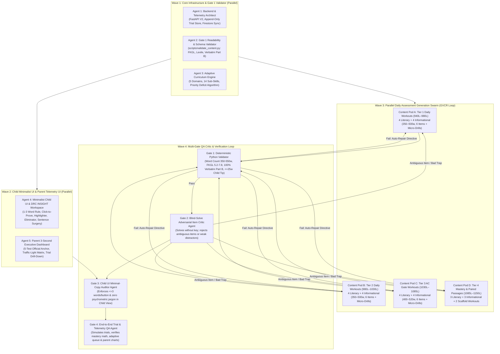

# V2 DRC BEACON Reading Platform: Agent Swarm Master Plan

## 1. Executive Synthesis of Research Topics (1–8)

All five specialized research agents have completed their deep-dive investigations and V1 codebase audits. Their reference documents are stored in `docs/v2_research/`:

| Topic | Reference Guide | Core Takeaway for V2 |
| :--- | :--- | :--- |
| **Topics 1 & 5: DRC BEACON & Lucas's Baseline** | [01_beacon_test_and_lucas_baseline.md](file:///usr/local/google/home/ivanramirez/.gemini/jetski/scratch/drc-beacon-ela-app/docs/v2_research/01_beacon_test_and_lucas_baseline.md) | Cobb County administers DRC BEACON 3x/year (Fall, Winter, Spring) via the **DRC INSIGHT** split-screen CAT engine. Lucas broke a 12-month `800L–840L` plateau with a **+140L surge to 940L** (`09/01/2026`). He is now **135L away** from the **1075L+** cutoff required for 6th Grade Advanced Content (AC ELA, AC Reading, AC Social Studies, AC Science) at Dickerson MS, with two official 5th-grade windows left (**Dec 2026** & **Mar 2027**). |
| **Topic 2: Lexile & Multi-Metric Readability Engineering** | [02_lexile_and_readability_engineering.md](file:///usr/local/google/home/ivanramirez/.gemini/jetski/scratch/drc-beacon-ela-app/docs/v2_research/02_lexile_and_readability_engineering.md) | V1 passages were too short (`169w` mean vs. BEACON's `350–550w` across `4–6` paragraphs) and 95% Informational. Unconstrained LLM prompts for `1000L+` drift to college-level FKGL (`14–18`). V2 enforces a deterministic **Multi-Metric Guardrail Suite**: `350–550` words, `4–6` numbered paragraphs, `45% Literary / 55% Informational` balance, **FKGL strictly `5.2–7.8`**, calibrated Mean Sentence Length (`13.8–18.0w`), and an explicit `1–2` "Monster Sentence" budget (`22–29w`) per passage. |
| **Topics 3, 4 & 5: High-ROI Learning & Diagnostic Curriculum** | [03_high_roi_learning_and_curriculum.md](file:///usr/local/google/home/ivanramirez/.gemini/jetski/scratch/drc-beacon-ela-app/docs/v2_research/03_high_roi_learning_and_curriculum.md) | Maximizes Lexile gain per minute via **10–12 min daily micro-workouts**: (1) **Active Text Verification** ("Click-to-Prove" sentence selection before choices unlock), (2) **Syntactic Sentence Surgery** (actor/action/receiver tagging on passive/nested clauses), (3) **Word Detective Morphology**, (4) **Named Distractor Trap Tagging** (`TRAP_WORD_MATCH`, `TRAP_TOO_NARROW`, `TRAP_EXTREME`, `TRAP_OUTSIDE_INFO`), and (5) **Adaptive Curriculum Prescription** across 5 GSE/BEACON domains (`14` sub-skills) climbing from `940L` $\rightarrow$ `1150L+`. |
| **Topics 6 & 7: Parent Telemetry & Minimal-Word Child UI** | [04_parent_tracking_and_child_ui_spec.md](file:///usr/local/google/home/ivanramirez/.gemini/jetski/scratch/drc-beacon-ela-app/docs/v2_research/04_parent_tracking_and_child_ui_spec.md) | **Child UI**: Enforces the **"Zero-Fluff" Rule** ($\le 3$ words per button/badge outside passages/items, zero psychometric jargon, 1-click "Start Today" hero button, DRC INSIGHT tools: `🖍️ Highlight`, `A-/A+`, `[✕]` option strikethrough, and `<25w` micro-feedback that auto-scrolls to the proving sentence). **Parent UI**: 3-second executive scan with the 5-test official BEACON anchor (`835L` $\rightarrow$ `940L`) + live V2 rolling estimate, Traffic-Light Skill Mastery Matrix (`🟢/🟡/🔴`), Top Weakness Alert card, and append-only trial history. |
| **Topic 8: V1 Audit & Multi-Agent QA Strategy** | [05_v1_lessons_and_qa_agent_strategy.md](file:///usr/local/google/home/ivanramirez/.gemini/jetski/scratch/drc-beacon-ela-app/docs/v2_research/05_v1_lessons_and_qa_agent_strategy.md) | Eliminates V1's `41,478`-line monolithic `index.html` collision bottleneck by sharding assessments into modular JSON files (`app/data/v2/`) and enforcing a **4-Gate Generator $\rightarrow$ Validator $\rightarrow$ Critic $\rightarrow$ Refiner (GVCR)** pipeline before any content or UI merges. |

---

## 2. Lucas's 5-Test Official BEACON Baseline & V2 Target Trajectory

| Test Date | Grade & Window | Official Reading Lexile | Official Math Quantile | Trajectory Analysis |
| :--- | :--- | :--- | :--- | :--- |
| `03/19/2025` | Grade 3 — Spring | **835L** | **500Q** | Strong 3rd-grade baseline (`750L–870L` book band) |
| `09/04/2025` | Grade 4 — Fall | **840L** (`+5L`) | **515Q** (`+15Q`) | Flat summer transition entering 4th grade |
| `12/17/2025` | Grade 4 — Winter | **830L** (`-10L`) | **760Q** (`+245Q`) | Math surged `+245Q`; Reading plateaued at ~830L |
| `03/18/2026` | Grade 4 — Spring | **800L** (`-30L`) | **700Q** (`-60Q`) | Spring 4th-grade dip; 12-month stagnation in `800L–840L` |
| `09/01/2026` | **Grade 5 — Fall (Current)** | **940L (`+140L`)** | *Not Tested* | **Breakout +140L surge** after V1 practice! Entered Grade Level Plus (`920L–1010L`) |
| `12/2026` *(Goal)* | Grade 5 — Winter | **1025L–1060L** | **900Q+** | Cross into upper 5th-grade stretch ceiling |
| `03/2027` *(Goal)* | Grade 5 — Spring | **1085L–1150L+** | **950Q+** | Exceed **1075L+** & **950Q+** Dickerson MS 6th Grade AC cutoffs |

---

## 3. V2 Modular Architecture (Eliminating V1's Monolith)

To allow 10+ subagents to build code and assessment banks in parallel with **zero file-locking or merge collisions**, V2 replaces the single `41,478`-line `index.html` with a clean modular architecture while preserving the zero-cost **FastAPI + Firestore (`lexile-growth-db`) + Cloud Run** deployment model:

```text
drc-beacon-ela-app/
├── app/
│   ├── main.py                          # FastAPI backend: V2 append-only trial API, adaptive queue API, Firestore sync
│   ├── validators/
│   │   └── readability_guard.py         # Deterministic Gate 1 Readability & Schema Validator
│   ├── data/
│   │   ├── curriculum_matrix.json       # 5 BEACON Domains, 14 GSE Sub-Skills, Lucas's 5-test baseline anchor
│   │   ├── daily_workouts/              # Sharded Daily Practice JSONs (zero merge conflict across parallel agents)
│   │   │   ├── tier1_940_980/           # Workouts 01–08 (Fall G5 Consolidation: 940L–980L, FKGL 6.0–6.6)
│   │   │   ├── tier2_980_1030/          # Workouts 09–16 (Bridge to 1000L+: 980L–1030L, FKGL 6.4–7.0)
│   │   │   ├── tier3_1030_1085/         # Workouts 17–24 (Dickerson AC Gate: 1030L–1085L, FKGL 6.8–7.4)
│   │   │   ├── tier4_1085_1150/         # Workouts 25–30 (Mastery Buffer: 1085L–1150L, FKGL 7.0–7.8)
│   │   │   └── tier0_scaffold_840_920/  # Workouts S1–S4 (Auto-triggered remedial scaffold if domain < 60%)
│   │   └── benchmarks_cat/              # Multi-Stage Adaptive (MST/CAT) Full Benchmark Simulations
│   └── static/
│       ├── index.html                   # Clean, lightweight V2 HTML shell (<600 lines)
│       ├── css/
│       │   └── v2_styles.css            # DRC INSIGHT split-screen & minimal-word child UI styles
│       └── js/
│           ├── state_and_telemetry.js   # Append-only trial recorder, rolling mastery & Lexile estimator
│           ├── adaptive_curriculum.js   # Priority Deficit Score (Pd) daily workout selector
│           ├── student_ui.js            # Zero-fluff Child UI, Click-to-Prove, Sentence Surgery, DRC tools
│           └── parent_dashboard.js      # 3-Second Executive Scan, Traffic-Light Matrix, Trial Inspector
├── scripts/
│   ├── validate_content.py              # CLI runner for Gate 1 deterministic validation
│   └── build_bundle.py                  # Validates all shards and compiles manifest
└── docs/v2_research/                    # Actionable Reference Guides (01 through 06)
```

---

## 4. Parallel Agent Swarm Architecture & Feedback Loops



### Detailed Swarm Execution Waves

#### Wave 1: Core Infrastructure, Telemetry Schema, & Deterministic Validator (3 Parallel Agents)
1. **`v2-validator-engineer` (`scripts/validate_content.py` & `app/validators/readability_guard.py`)**:
   - Implements the zero-dependency Python readability & schema validator from `02_lexile_and_readability_engineering.md` and `05_v1_lessons_and_qa_agent_strategy.md`.
   - Enforces:
     - Passage length: `350–550` words across `4–6` numbered paragraphs (`\n\n` separated).
     - Readability guardrails: **FKGL `5.2–7.8`** (strictly `< 8.0`), calibrated **Estimated Lexile Proxy** within `±25L` of target band, Mean Sentence Length (`12.5–18.0w`), and `1–2` tagged "Monster Sentences" (`22–29w`) per passage.
     - **100% Verbatim Substring Match** for all EBSR Part B quotation options against the passage text.
     - **Distractor Archetype Coverage**: Every wrong option tagged with `TRAP_WORD_MATCH`, `TRAP_TOO_NARROW`, `TRAP_EXTREME`, `TRAP_OUTSIDE_INFO`, or `TRAP_SYNTACTIC_REVERSAL`.
     - **Child Micro-Feedback Constraint**: `childTip` strictly $\le 25$ words with zero banned psychometric terms (`DOK`, `Pillar`, `SEM`, `Lexile`, `Syntactic`, `Nominalization`), paired with a mandatory `provingSentenceText` substring that exists verbatim in the passage for automatic green highlighting.
2. **`v2-backend-telemetry-architect` (`app/main.py` & `app/data/curriculum_matrix.json`)**:
   - Upgrades the FastAPI backend and Firestore (`lexile-growth-db`) schema to support **append-only `trialHistory`**, **domain/sub-skill mastery tracking** across all 5 BEACON domains (`14` GSE sub-skills), **first-try vs. retry accuracy**, **item-level time & impulsivity/hesitation flags**, and **Lucas's 5 official BEACON baseline anchors** (`835L`, `840L`, `830L`, `800L`, `940L`).
   - Exposes REST endpoints for `/api/v2/progress`, `/api/v2/trial` (records a completed daily practice or benchmark trial), `/api/v2/workouts` (serves validated daily workout shards), and maintains full backward compatibility.
3. **`v2-curriculum-engine-architect` (`app/static/js/state_and_telemetry.js` & `app/static/js/adaptive_curriculum.js`)**:
   - Implements the exponentially recency-weighted Domain Mastery calculation ($M_d$) and Priority Deficit Score ($P_d$) algorithm from `03_high_roi_learning_and_curriculum.md`.
   - Automatically selects **"Today's Practice"** based on Lucas's lowest mastery domain, recent distractor trap vulnerability, and current rolling Lexile tier (`940L` $\rightarrow$ `1150L`), while allowing parents to queue a specific targeted domain with 1 click.

#### Wave 2: Minimal-Word Child UI & High-Signal Parent Dashboard (2 Parallel Agents)
4. **`v2-child-ui-specialist` (`app/static/index.html`, `app/static/css/v2_styles.css`, `app/static/js/student_ui.js`)**:
   - Builds the **Zero-Fluff Student Experience** specified in `04_parent_tracking_and_child_ui_spec.md`:
     - **Header Bar**: Student avatar, `🔥` streak badge, `⭐ Level` progress bar, and a parent lock icon `🔒 Parent`.
     - **Daily Launchpad**: 1-click Hero Card (`▶️ Start Today's Practice`) + 3 visual adventure cards (`📖 Story Quest`, `🔬 Discovery Lab`, `⚡ Speed Boost`).
     - **DRC INSIGHT Split-Screen Reader**:
       - Left Pane: `[1]`–`[6]` paragraph badges, `🖍️ Highlight` toggle, `📏 Line Guide` horizontal reading bar, and `A- / A+` font size toggle.
       - Right Pane: Colored progress dots (`🟢 🟡 🔵 ⚪`), **Active Text Verification ("Click a sentence in Paragraph X to unlock choices")** on targeted items, A/B/C/D cards with 1-click `[✕]` strikethrough eliminator, and `◀ Back` / `✓ Check` / `Next ▶` buttons ($\le 3$ words per control).
       - **Interactive "Sentence Surgery" Warm-Up**: 30-second visual tap-to-tag (`WHO` / `ACTION` / `WHAT`) on the passage's Monster Sentence.
       - **Concise Micro-Feedback**: `🟢 Nice Job!` or `🟡 Try One More Time!` (2-attempt scaffolding), auto-scrolling and pulsing the exact proving sentence in the passage, plus a `<25-word` kid-friendly tip.
5. **`v2-parent-dashboard-specialist` (`app/static/js/parent_dashboard.js`)**:
   - Builds the **3-Second Executive Parent Dashboard**:
     - **Card 1 — Longitudinal Lexile Trajectory**: Plots Lucas's 5 official Cobb County BEACON reports (`835L` $\rightarrow$ `840L` $\rightarrow$ `830L` $\rightarrow$ `800L` $\rightarrow$ `940L`) alongside his live V2 Rolling Estimate (`±SEM`) and the `1075L+` Dickerson MS AC cutoff line.
     - **Card 2 — Traffic-Light Skill Mastery Matrix**: `🟢 Mastered (≥85%)` / `🟡 Developing (65–84%)` / `🔴 Needs Practice (<65%)` across all 5 BEACON domains split by **Literary vs. Informational** passages.
     - **Card 3 — Top Actionable Weakness Alert**: Auto-identifies Lucas's #1 bottleneck over the last 4 trials (e.g., *Informational Text Structure* or *Copy-Paste Word-Match Trap*) with a 1-click `[🎯 Queue Targeted Practice]` button.
     - **Secondary Diagnostics**: Distractor Trap Radar (4 BEACON traps), Pacing & Stamina Strip (`⚡ Impulsive <8s` vs. `🎯 Optimal` vs. `🐢 Hesitation >90s`), Dickerson MS 6th Grade AC Placement Tracker, and the **Append-Only Trial Log & Item Inspector Drawer**.

#### Wave 3: Parallel Daily Assessment Generation Swarm (4 Parallel Content Pods + GVCR Loop)
To provide a rich, exam-authentic bank of daily practices spanning Lucas's journey from **940L to 1150L**, 4 parallel Content Generator Pods will author **24+ Complete Daily Assessments** (strictly balanced **45% Literary / 55% Informational**, `350–550` words, `4–6` paragraphs, `6` BEACON-authentic items per workout including `1` Sentence Surgery warm-up, `1` Contextual Tier 2/Morphology item, `1` Structure/POV item, `1` DOK 2/3 Inference/Multi-Select item, and `1` linked **EBSR Part A + Part B Verbatim Proof pair**):
6. **`content-pod-tier1` (`940L–980L`, FKGL `6.0–6.6`)**: 6 Daily Assessments (3 Literary, 3 Informational) — *Fall 5th Grade Consolidation*.
7. **`content-pod-tier2` (`980L–1030L`, FKGL `6.4–7.0`)**: 6 Daily Assessments (3 Literary, 3 Informational) — *Upper 5th Grade Stretch Transition*.
8. **`content-pod-tier3` (`1030L–1085L`, FKGL `6.8–7.4`)**: 6 Daily Assessments (3 Literary, 3 Informational) — *Dickerson MS 1075L+ AC Qualification Gate*.
9. **`content-pod-tier4` (`1085L–1150L`, FKGL `7.0–7.8` + Remedial `860L–920L` Scaffolds)**: 6 Daily Assessments (2 Literary, 2 Informational, 2 Remedial Scaffold Workouts) — *6th/7th Grade Mastery Buffer*.

#### Wave 4: Multi-Gate QA Critic & End-to-End Verification Loop
10. **Gate 1 Automated Run (`scripts/validate_content.py`)**: Every generated JSON shard is run through the deterministic validator. Any passage outside `350–550w`, FKGL `5.2–7.8`, Lexile `±25L`, or with a non-verbatim Part B quote is automatically rejected with exact mathematical repair directives until 100% pass.
11. **Gate 2 Adversarial Blind-Solve Critic (`qa-item-critic`)**: Reviews every workout with the answer key hidden; verifies 100% unambiguous correct answers, realistic BEACON distractor traps, and strict Part A $\rightarrow$ Part B entailment.
12. **Gate 3 & Gate 4 UI & E2E Verification (`qa-child-ui-auditor` & `qa-telemetry-e2e`)**: Starts the FastAPI server, audits the Student UI for the $\le 3$-word button rule and zero psychometric jargon, simulates student trials (1st-try, 2nd-try, impulsive, and mastery flows), and verifies that trial logs, rolling Lexile estimates, and Parent Dashboard Traffic-Light matrices update with 100% mathematical accuracy.
